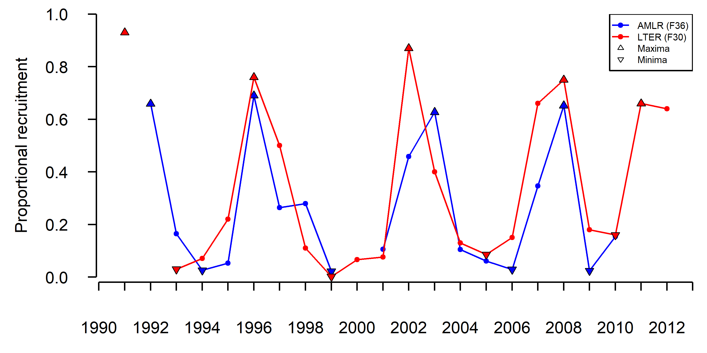
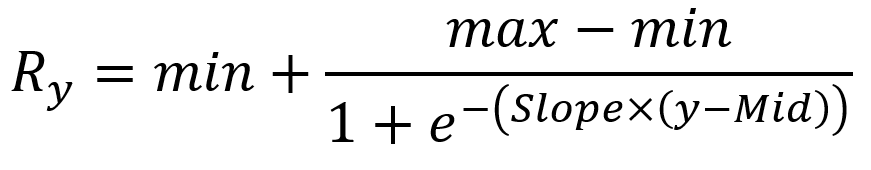
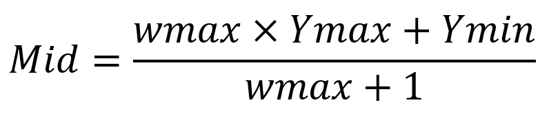
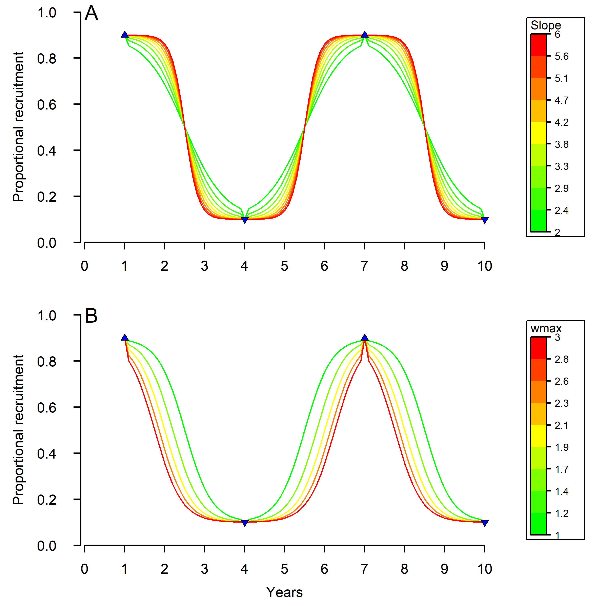
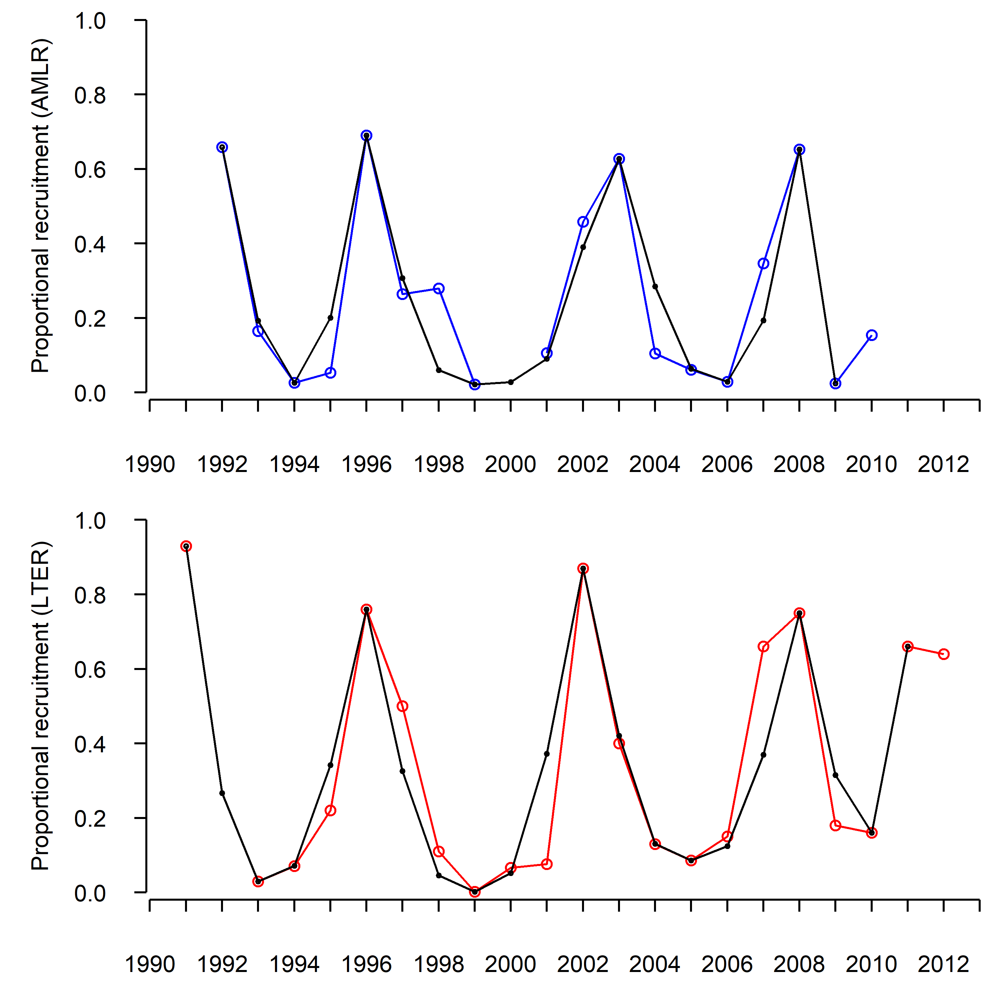
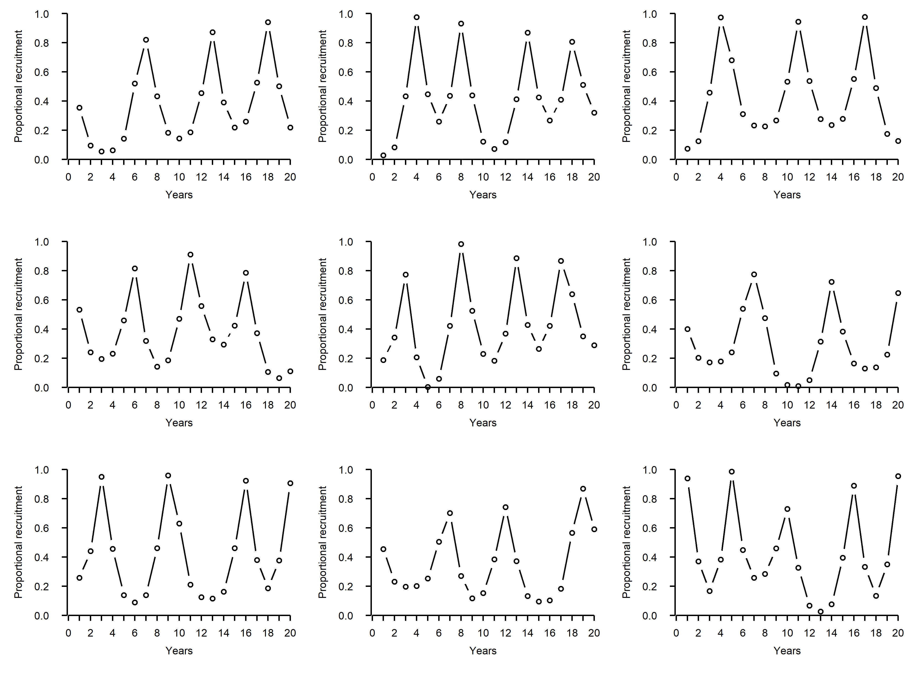

<!-- README.md is generated from README.Rmd. Please edit the .Rmd file -->

```{r, echo = FALSE}
knitr::opts_chunk$set(
  collapse = TRUE,
  comment = "#>"
)
library(knitr)
```


### RecMaker - Krill proportional recruitment time series simulator

This R script generates annual time series of proportional recruitment while accounting for the cyclical nature of Antarctic krill recruitment. Its outputs may be used as inputs in population dynamics models. Stochasticity is included in recruitment periodicity and the amplitude of extremes. The aim of this simulator is to produce recruitment series with defined statistical properties that also capture the important characteristics of empirical time series.


#### Published timeseries

The two longest published Antarctic krill proportional recruitment time series originate from the LTER and AMLR programmes (Fig. 1).

```{r out.width='100%',fig.cap="Figure 1. Antarctic krill proportional recruitment time series as reported by the AMLR (F36 is the proportion of individuals smaller than 36mm, Kinzey et al, 2013) and LTER (F30 is the proportion of individuals smaller than 30mm, Ryabov et al, 2017; supplement)." ,echo=F}

```


#### RecMaker functioning

To generate proportional recruitment time series, RecMaker follows these steps:

1. Create a vector of years in which maximum recruitment occur where the period between years is randomly generated between chosen bounds.

2. Generate a vector of years at the midpoints between consecutive years of maximum recruitment, in which minimum recruitment occur.

3. Generate maximum and minimum recruitment values between chosen bounds.

4. Interpolate values between the maximum and minimum using a local logistic function (a logistic function between each consecutive extreme; *i.e.*, min to max or max to min).

#### Calibration

The local logistic functions used in RecMaker to interpolate recruitment in year *y* (*R<sub>y</sub>*) between extremes (*min* and *max*), are computed as:

```{r out.width='30%',echo=F}

```

Where *Slope* controls the slope and *Mid* controls the midpoint of the logistic functions, and is computed as:

```{r out.width='26%',echo=F}

```

Where *wmax* is the weight put on the year of maximum recruitment (*Ymax*) and may be modulated to adjust the midpoint of the logistic function, which controls the relative duration of periods of high recruitment and low recruitment.


```{r out.width='70%',fig.cap="Figure 2. Effects of *Slope* (**A**) and *wmax* (**B**) on the Logistic interpolation of recruitment between extremes (blue triangles)." ,echo=F,fig.align="center", eval=F}

```


Using the empirical series (Fig. 1), time series of minima (a value that was lower than the preceding and succeeding values) and maxima (a value that was greater than the preceding and succeeding values) were used to calibrate *Slope* and *wmax*. 

The calibration of *Slope* and *wmax* was done by finding the values that minimized the Root Mean Square Error between the empirical time series and the simulated ones. As a result (Fig. 2), these values were determined to be:

* *Slope*=2.5
* *wmax*=2.4

```{r out.width='70%',fig.cap="Figure 2. Published recruitment time series (blue: AMLR; red: LTER) and simulated ones (black)." ,echo=F,fig.align="center"}

```


#### Example outputs

The figure below (Fig. 3) shows 9 time series generated by RecMaker using the following parameters:

* *Slope*=2.5
* *wmax*=2.4
* *Mins*=c(0,0.3)
* *Maxs*=c(0.7,1)
* *Periods*=c(4,7)

```{r out.width='100%',fig.cap="Figure 3. Examples of proportional recruitment time series as simulated by RecMaker.",echo=F}

```

