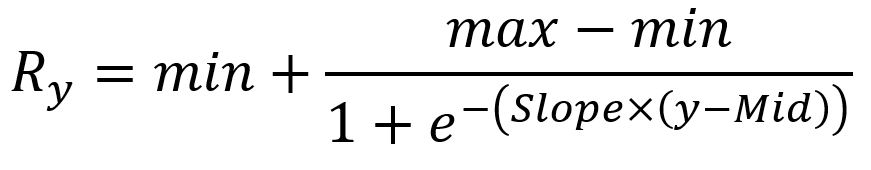
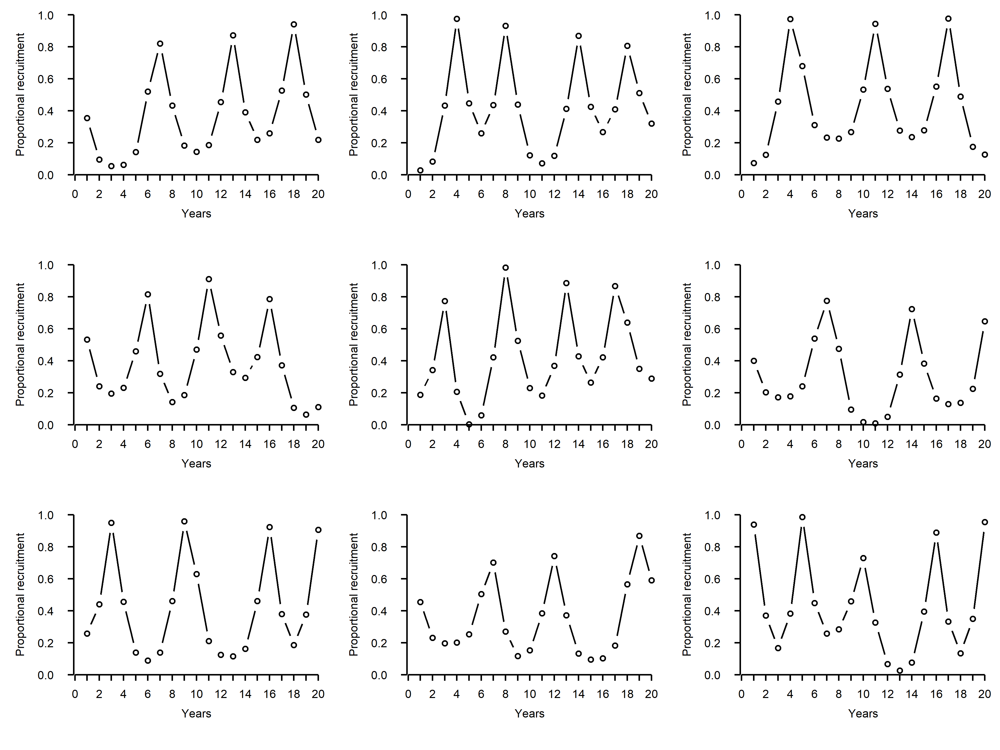

<!-- README.md is generated from README.Rmd. Please edit the .Rmd file -->

### RecMaker - Krill proportional recruitment time series generator

This R script generates annual time series of proportional recruitment
while accounting for the cyclical nature of Antarctic krill recruitment
events. Its outputs may be used as inputs in population dynamics models.
Stochasticity is included in the period between recruitment events and
the amplitude of extremes.

#### Published timeseries

The two longest published Antarctic krill proportional recruitment time
series originate from the LTER and AMLR programmes (Fig. 1).

Figure 1. Antarctic krill proportional recruitment time series (*Fx*:
proportion of individuals below size x) as reported by the AMLR (Kinzey
et al, 2013) and LTER (Ryabov et al, 2017; supplement). The range of
minima (*Mins*, downward triangles), maxima (*Maxs*, upward triangles)
and periods between recruitment events (*Periods*) are indicated.

#### RecMaker functioning

To generate proportional recruitment time series, RecMaker follows these
steps:

1.  Generate a vector of years in which maximum recruitment occur. The
    period between these years is randomly generated between chosen
    bounds (*e.g.*, see *Periods* in Fig. 1).

2.  Generate a vector of years in which minimum recruitment occur as
    midpoints between years of maximum recruitment.

3.  Randomly generate maximum and minimum recruitment values between
    chosen bounds (*e.g.*, see *Maxs* and *Mins* in Fig. 1).

4.  Interpolate values between the extremes generated above using local
    Logistic functions (a Logistic function between each consecutive
    extreme; *i.e.*, min to max or max to min).

#### Calibration

The local Logistic functions used in RecMaker to interpolate recruitment
in year *y* (*Ry*) between extremes (*min* and *max*), are
computed as:

Where *Slope* controls the slope and *Mid* controls the midpoint of
Logistic functions, which is computed as:

Where *wmax* is the weight put on the year of maximum recruitment
(*Ymax*) which may be modulated to adjust the duration of high
recruitment and low recruitment events (see Fig. 2).

Figure 2. Effects of *Slope* (**A**) and *wmax* (**B**) on the Logistic
interpolation of recruitment between extremes (blue triangles).

The calibration of *Slope* and *wmax* was done by finding the values
that minimized the Root Mean Square Error between published time series
(Fig. 1) and generated time series. As a result (Fig. 3), these values
were determined to be:

  - *Slope*=2.5
  - *wmax*=2.4

Figure 3. Published recruitment time series (blue: AMLR; red: LTER) and
generated ones (black).

#### Example outputs

The figure below (Fig. 4) shows 9 time series generated by RecMaker
using the following parameters:

  - *Slope*=2.5
  - *wmax*=2.4
  - *Mins*=c(0,0.3)
  - *Maxs*=c(0.7,1)
  - *Periods*=c(4,7)

Figure 4. Examples of proportional recruitment timeseries as generatd by
RecMaker.

